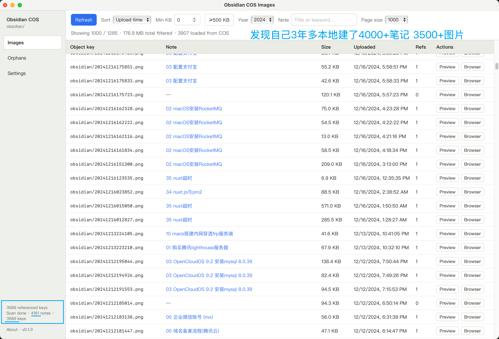

# Obsidian COS Images

Manage **PicGo → Tencent COS** images used by **Obsidian** Markdown notes.

Built with **Go + Wails v3** (React / TypeScript).

Download prebuilt macOS builds from **[Releases](https://github.com/uniquejava/obsidian-cos-images/releases)** (tag `v*` triggers CI).



## Features

- List COS objects under a configured prefix; sort by upload time or size
- Map each image to the Obsidian notes that reference it; open notes in-app
- Filter by min size (incl. **≥500 KB**), upload **year**, and note title/keyword
- Find **orphans** (on COS but unused in any scanned vault); export CSV/JSON; delete with confirm
- **Compress & replace** large JPEG/PNG on the same object key (Markdown URLs unchanged)
- Settings-first COS + vault config (persisted locally; optional `.env` for dev)


## Docs

| File | Purpose |
|------|---------|
| [AGENTS.md](AGENTS.md) | Current status + how to run / package |
| [docs/REQUIREMENTS.md](docs/REQUIREMENTS.md) | Product scope |

## Requirements

- macOS 12+ (packaged as `.app`)
- Go 1.25+
- Node.js / npm
- [Wails v3 CLI](https://v3.wails.io): `go install github.com/wailsapp/wails/v3/cmd/wails3@v3.0.0-beta.6`
- Optional for PNG recompress: `brew install pngquant oxipng`

## Dev

```bash
cd ~/code/golang-projects/obsidian-cos-images
# Optional: .env as a shortcut while developing (never commit)
cp .env.example .env
wails3 task dev
```

On first launch without config, open **Settings** and save COS credentials + vault paths.

## Package (macOS)

```bash
wails3 package
# → bin/obsidian-cos-images.app  (~13 MB; DMG/zip ~6 MB)
open bin/obsidian-cos-images.app
# or install:
# cp -R bin/obsidian-cos-images.app "/Applications/Obsidian COS Images.app"
```

## Config

| Source | Role |
|--------|------|
| **Settings UI** | Primary — COS identity, vault paths, thumbnails |
| **OS user config file** | Persistence (`config.json`, mode `0600` when written) |
| **`.env`** | Dev-only fallback for fields still empty in saved config |

See `.env.example` for env var names.

**Do not commit** real `SecretId` / `SecretKey`, bucket (`name-appid`), base URL, or vault paths. Those belong only in the Settings UI (or a local gitignored `.env`). A public bucket URL + AppId can be abused for traffic.

